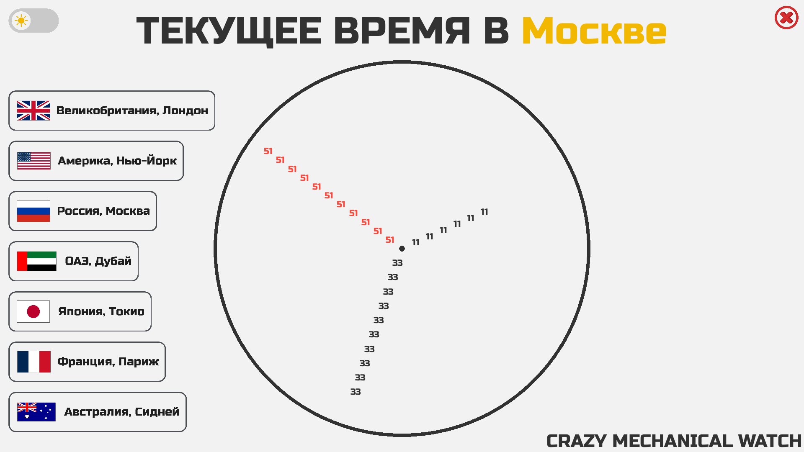

# CRAZY MECHANICAL WATCH

[](README.en.md)

Это, пожалуй, одни из самых оригинальных механических часов, которые вы когда-либо встречали. Их уникальность, стиль и практичность заключаются в стрелках и циферблате: сам циферблат пустой, а стрелки представляют собой цифры, показывающие текущее время.
Для удобства предусмотрен тумблер между тёмной и светлой темами. Кроме того, дополнительные кнопки позволяют одновременно отслеживать время в нескольких часовых зонах по всему миру.

---


---

### Использование ⚙️
Установите необходимые библиотеки   
```
pip install -r requirements.txt
```

После чего можно запускать файл `watch_app.py` и увидеть сие творение)
